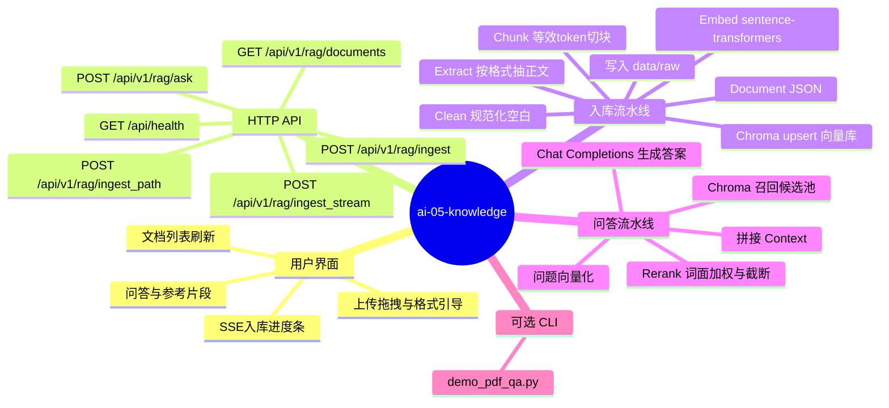
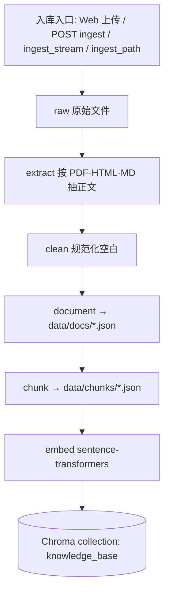
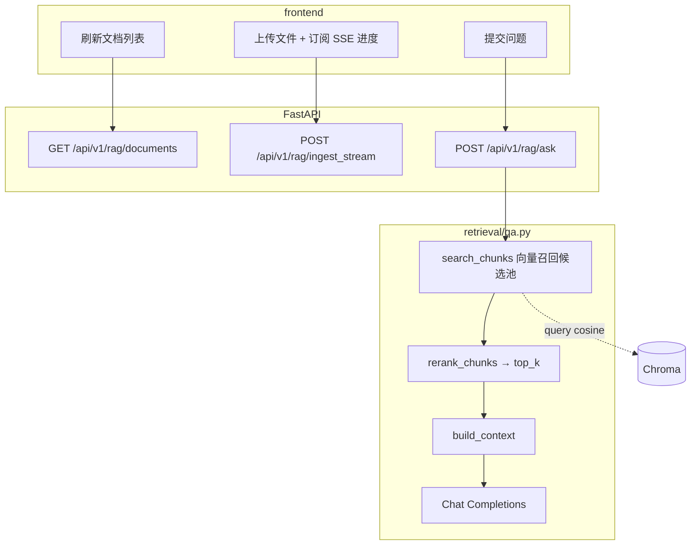
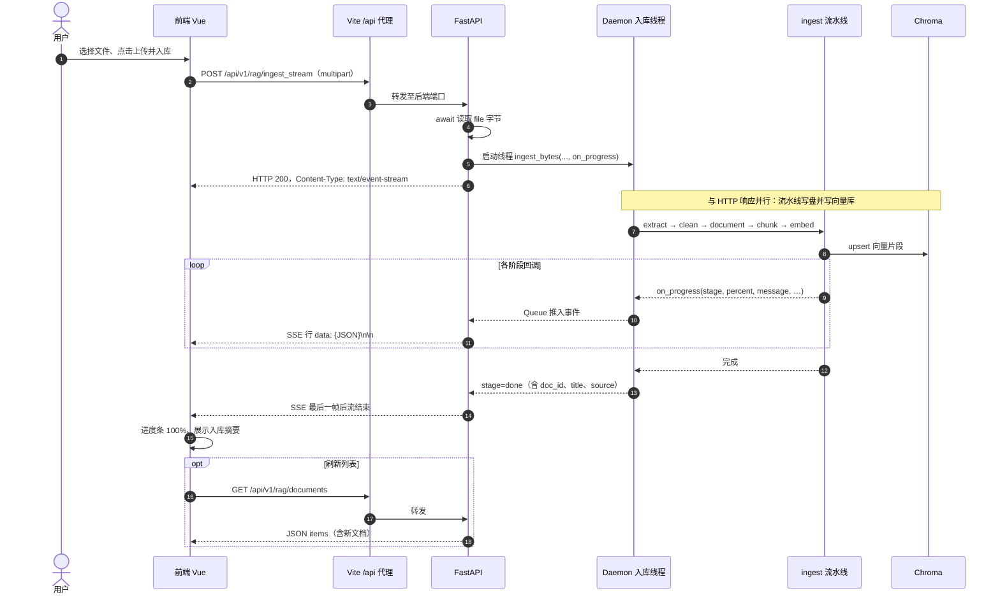
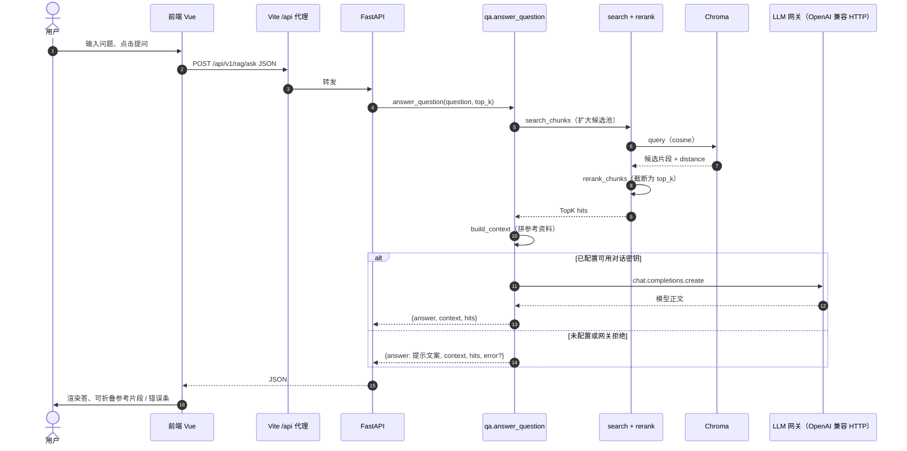
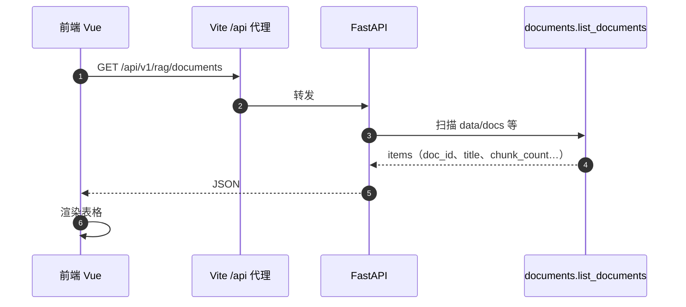

# ai-05-knowledge

本地 **RAG（检索增强生成）** 演示项目：把 **PDF、HTML、Markdown** 做成可检索知识库，再用 **OpenAI 兼容** 的对话接口生成回答。向量与检索在本地完成，不依赖在线 embedding 服务。

---

## 特性

- **多格式入库**：`.pdf`、`.html` / `.htm`、`.md` / `.markdown`；抽取 → 清洗 → 分块 → **sentence-transformers** 向量 → **Chroma** 持久化。
- **检索与重排**：向量召回后做轻量 **rerank**（词面命中加权、低信息片段降权），缓解单一大文档占满 TopK。
- **HTTP API**：健康检查、文档列表、同步/流式（SSE）入库、基于知识库的问答。
- **Web 界面**：Vue 3 + Vite；上传区带格式说明与拖拽；入库进度 SSE；问答卡片与可折叠引用片段。

---

## 技术栈

| 层级 | 选型 |
|------|------|
| 后端 | Python 3.10+、FastAPI、uvicorn、chromadb、openai SDK（兼容任意 OpenAI 形态网关） |
| 向量 | sentence-transformers（默认 `all-MiniLM-L6-v2`，可在 `.env` 调整） |
| 前端 | Vue 3、Vite；开发态将 `/api` 代理到本机后端 |

---

## 快速开始

**前提**：已安装 **Python 3.10+**、**Node.js 18+**。以下命令在**本仓库根目录**（含 `backend/`、`frontend/`）下执行。

### 1. 后端

```bash
cd backend
python3 -m venv .venv
source .venv/bin/activate   # Windows: .venv\Scripts\activate
pip install -r requirements.txt
cp .env.example .env
# 编辑 .env，至少配置「对话模型」所需密钥（见下文「配置说明」）
uvicorn app.main:app --host 127.0.0.1 --port 8905
```

默认 API 根地址：`http://127.0.0.1:8905`。

### 2. 前端

```bash
cd frontend
npm install
npm run dev
```

浏览器打开终端提示的地址（默认 **`http://127.0.0.1:9175`**）。页面通过 Vite 代理访问 **`/api/*`**，无需改 CORS。

### 3. 可选：命令行 PDF 演示

不启动 Web 也可跑最小链路（无 Key 时仅输出检索片段）：

```bash
cd backend && source .venv/bin/activate
OPENAI_API_KEY= python demo_pdf_qa.py
```

---

## 配置说明

配置文件：**`backend/.env`**（勿提交版本库）。模板见 **`backend/.env.example`**。

### 使用 OpenAI 官方或其它兼容网关

```env
OPENAI_API_KEY=sk-...
OPENAI_BASE_URL=https://api.openai.com/v1
OPENAI_MODEL=gpt-4o-mini
```

### 使用讯飞星火 Lite（HTTP，OpenAI 兼容路径）

- 在讯飞控制台使用 **「HTTP 服务接口认证」** 中的 **APIPassword**（单列字符串）。**不要**把仅用于 WebSocket 的 **`APPID:APISecret`** 当作 HTTP 的 Bearer，否则常见 **401**、**apikey not found** 等错误。
- 推荐单独配置（本仓库问答会**优先**读取）：

```env
SPARK_HTTP_API_PASSWORD=你的APIPassword
```

也可使用别名 **`XFYUN_HTTP_API_PASSWORD`**。仍可将同一密码写在 **`OPENAI_API_KEY`**（不要加 `Bearer ` 前缀与多余引号）。

```env
OPENAI_MODEL=lite
# OPENAI_BASE_URL 可留空，程序会使用星火 OpenAI 兼容网关地址
```

可选：**`SPARK_CHAT_USER`**，写入请求体 `user` 字段（默认 `ai-05-knowledge-rag`）。

向量模型、Chroma 路径、切块大小等见 **`.env.example`** 内注释。

### 本地多目录时的环境变量补全（可选）

若 **`backend/.env`** 里某键**留空**，程序在启动时会按内置顺序尝试读取**固定相对路径**下的其它 `backend/.env` 以**仅补空项**（不覆盖你已填写的值）。单仓库使用时只要在 **`backend/.env`** 写全即可，无需依赖该行为。

---

## 仓库结构（后端摘要）

```
backend/
├── data/raw|parsed|docs|chunks/   # 流水线落盘
├── pipelines/                      # 抽取、清洗、文档、切块、嵌入、入库
├── retrieval/                      # 检索、重排、问答
├── vector_db/chroma/               # Chroma 数据目录（运行时生成，默认 gitignore）
├── api/app.py                      # HTTP 路由
└── app/main.py                     # ASGI 入口
```

---

## 流水线说明

**入库**：原始文件 → 按类型抽取正文 → 规范化空白 → 写入 Document JSON → 按「等效 token」预算切块（本地 **approx** 估算，不依赖 tiktoken 联网下载）→ 向量 → Chroma `upsert`（cosine）。

**问答**：问题向量化 → Chroma 取较大候选池 → **rerank** 截断为 `top_k` → 拼接上下文 → **Chat Completions**；未配置 Key 或调用失败时仍返回检索片段便于调试。

---

## 完整流程（脑图）

下列图表在 **GitHub**、**GitLab** 及多数支持 [Mermaid](https://mermaid.js.org/) 的 Markdown 预览中可直接渲染；本地若看不到图，可将代码块复制到 [Mermaid Live Editor](https://mermaid.live/) 查看。

### 总览脑图



### 入库与数据落盘（流程图）



### 问答与前端调用（流程图）



上图 **`ingest_stream`** 与 **`/ask`** 共用同一向量库；入库完成后 **`documents`** 即可看到新文档，无需重启。

### 完整交互时序图

以下按**开发态**绘制（浏览器 → **Vite 开发服务器** `/api` 代理 → **uvicorn**）。若生产环境前后端同源或由网关转发，可将「Vite 代理」一步理解为等价反向代理。

#### 1）流式入库（`ingest_stream` + SSE）



#### 2）知识库问答（`/ask`）



#### 3）文档列表（页面加载或手动刷新）



---

## HTTP API

| 方法 | 路径 | 说明 |
|------|------|------|
| GET | `/api/health` | 运行状态、嵌入模型、是否走星火网关、密钥是否就绪等 |
| GET | `/api/v1/rag/documents` | 已入库文档列表 |
| POST | `/api/v1/rag/ingest` | `multipart/form-data`：`file`，可选 `title` |
| POST | `/api/v1/rag/ingest_stream` | 同上，响应 **SSE**，推送阶段与进度 |
| POST | `/api/v1/rag/ingest_path` | JSON 本机绝对路径入库（调试） |
| POST | `/api/v1/rag/ask` | JSON：`question`、`top_k`（可选） |

---

## 生产构建（前端）

```bash
cd frontend
npm run build
npm run preview   # 与 dev 相同，默认带 /api 代理，需本机后端已启动
```

---

## 版本管理

本目录可作为**独立 Git 仓库**使用：`git init` / `commit` / `push` 均在仓库根目录完成；远程与 CI 由你自行配置。
